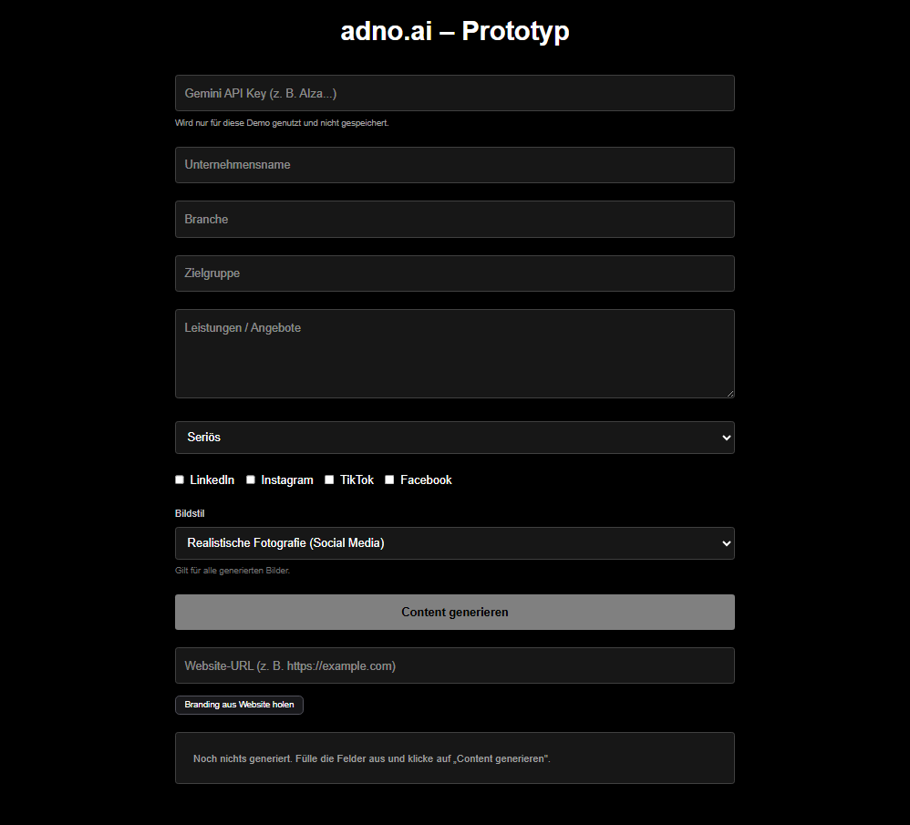
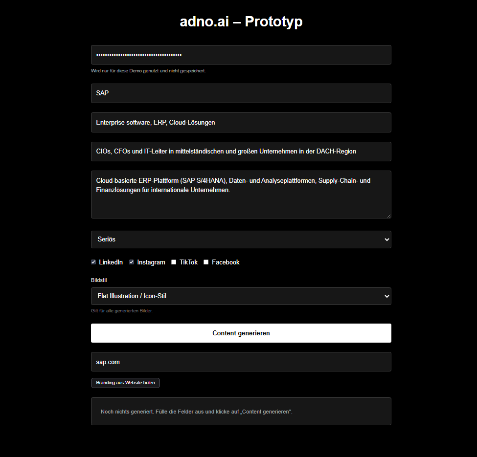
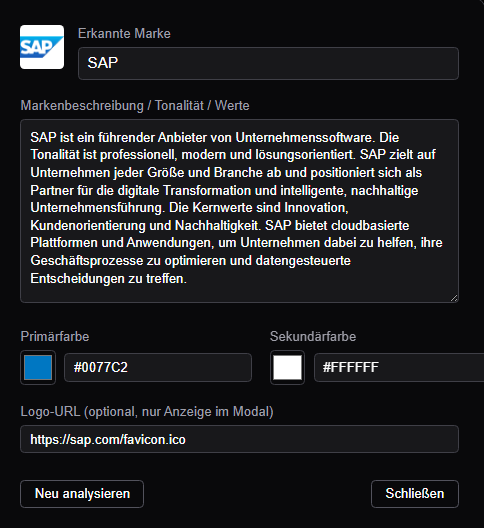

# Adno AI – Public Showcase Repository

> Note: This is a showcase repository for presentation purposes.  
> The full production prototype lives in a private repository (`adno-ai-prototype`) and is not publicly accessible.  
> This repo provides an overview, screenshots and demo access for recruiters, partners or investors.

---

# What is Adno AI?

Adno AI is an intelligent content automation tool that generates complete, ready-to-publish social media posts for businesses.

Unlike classic AI text generators, Adno AI produces full campaign assets, including:

- Content ideas & messaging angles  
- Social media captions (platform-aware)  
- Hooks, CTAs & hashtag strategy  
- AI-generated visuals tailored to each platform  
- Automatic brand adaptation through website analysis  

Adno AI is built for SMEs and small marketing teams that need professional, consistent online content without hiring an agency.

---

# Brand-Aware Content Generation

One of Adno AI’s core capabilities is automatic brand extraction.

By entering a website URL, the system:

- Fetches public HTML  
- Extracts brand name, tone, messaging patterns  
- Detects primary & secondary colors  
- Identifies logos, icons or stylistic patterns  
- Summarizes the brand’s positioning & communication style

This branding profile is then used to generate posts and images that feel fully on-brand.

(The user can also manually adjust branding values in the UI.)

---

# Live Demo

- Website: https://adno.ai  
- Demo Password: `test321`

The demo runs in a restricted mode using the user’s own Gemini API key (not stored).

---

# Demo Video

Product Walkthrough: https://youtu.be/AQ6cjH9Q-70

The video demonstrates:

1. Providing company data  
2. Selecting tone & platforms  
3. Choosing an image style  
4. Website-based branding extraction  
5. Generating complete social media posts  
6. Creating visuals tailored to platform format (1:1, 3:4, 9:16, etc.)

---

# Key Features

✔ Intelligent Content Generation  
✔ Platform-Aware Visual Generation  
✔ Automatic Brand Extraction  
✔ Editable Branding Panel  
✔ On-Brand Image Prompts  
✔ User-Provided Gemini API Key (not stored)

Details:

- Company & audience input fields  
- Tone presets (Serious, Casual, Motivating, Luxurious)  
- Channel selection: LinkedIn, Instagram, TikTok, Facebook  
- Image style selection: Realistic photo, Flat illustration, Clean 3D render  
- Website-based branding extraction (colors, tone, summary)  
- Consistent brand-aware image prompts  
- Secure demo mode using local Gemini key

---

# Screenshots

| Dashboard | Input Form | Generated Posts | Branding Editor |
|----------|------------|-----------------|-----------------|
|  |  | |  |

---

# Tech Stack

Frontend  
- Next.js (App Router)  
- React  
- TypeScript  
- Tailwind CSS  

Backend  
- Next.js API Routes  
- Serverless architecture  
- Gemini 2.x (Text + Image models)

Hosting  
- Vercel

---

# Architecture Overview

Client (Next.js + React) 
⇅  
API Layer (Next.js Serverless Functions) 
⇅  
Gemini API (text + image generation)

---

# Project Status

Adno AI is in an early prototype phase, currently validating:

- Usability  
- Quality of branding extraction  
- Accuracy of brand-adapted content  
- Reliability of image generation  

Upcoming roadmap:

- Saving brands & campaigns  
- Versioning system  
- Content calendar  
- Campaign templates  
- Publishing integrations (Meta, LinkedIn, TikTok)  
- Multi-brand workspaces

---

# Contact

If you're a recruiter, engineer, investor or collaborator:

Website: https://giorgiildani.de  
Email: giorgi1ildani@gmail.com  
LinkedIn: https://www.linkedin.com/in/giorgi-ildani-135522249/

